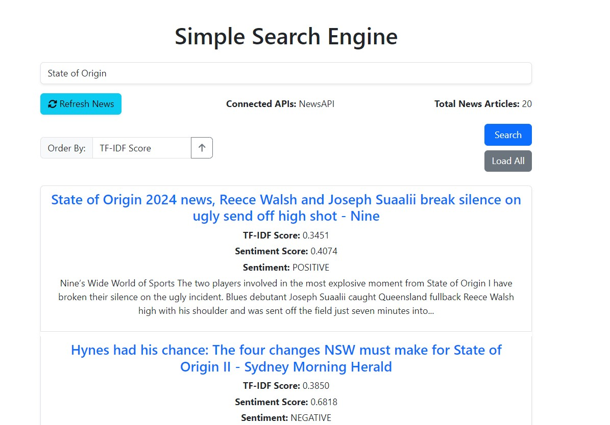

# Simple News Search Engine

## Overview

This Simple News Search Engine will pull top news articles using NewsAPI, the articles will then be web-scraped using BeautifulSoup, and sentiment analysis will be performed on the returned data. If the user searches, a TF-IDF value will be calculated and returned, this will rank the news articles based on relevance to the search. Note, titles have higher weight.

## Features

- **Search Functionality**: Users can enter a search query to find relevant news articles.
- **Sorting Options**: Users can sort the search results by TF-IDF score, sentiment score, or sentiment label.
- **Pagination**: Users can load more articles in increments or load all articles at once.
- **Sentiment Analysis**: Each article is analyzed for sentiment (positive, negative, or neutral).
- **Article Descriptions**: A brief description of each article is displayed.

## Screenshots



## Setup and Installation

### Prerequisites

- Node.js and npm
- Python 3.x
- NewsAPI key (You can get one from [NewsAPI](https://newsapi.org/))

### Backend Setup

1. **Clone the Repository**

   ```sh
   git clone https://github.com/nHunter0/Search-Engine.git
   cd News-Search-Engine
   ```

2. **Install Python Dependencies**

   ```sh
   pip install -r requirements.txt
   ```

3. **Modify API Key**

   Register for an account on [NewsAPI](https://newsapi.org/), then copy and paste the API key into the `NEWS_API_KEY` variable in `app.py`.

4. **Run the Flask Server**
   ```sh
   export FLASK_APP=app.py
   flask run
   ```

### Frontend Setup

1. **Navigate to the Frontend Directory**

   ```sh
   cd search-engine
   ```

2. **Install Node.js Dependencies**

   ```sh
   npm install
   ```

3. **Start the React Application**
   ```sh
   npm start
   ```

## Code Structure

### Backend (Flask)

- **app.py**: Main Flask application file. Handles routes for searching, refreshing news, and analyzing sentiment.

### Frontend (React)

- **src/Search.js**: Main React component for the search interface.
- **public/index.html**: HTML template.
- **src/index.js**: Entry point for the React application.

## Dependencies

### Backend

- `flask`: Web framework for Python.
- `flask-cors`: For handling Cross-Origin Resource Sharing (CORS).
- `requests`: For making HTTP requests to the NewsAPI.
- `beautifulsoup4`: For scraping article content from URLs.
- `scikit-learn`: For TF-IDF vectorization.
- `transformers`: For sentiment analysis using pre-trained models.
- `torch`: For running transformer models.
- `numpy`: For numerical operations.

### Frontend

- `react`: JavaScript library for building user interfaces.
- `axios`: Promise-based HTTP client for the browser and Node.js.
- `bootstrap`: CSS framework for styling.
- `react-bootstrap`: Bootstrap components for React.
- `@fortawesome/fontawesome-svg-core`: Core package for Font Awesome.
- `@fortawesome/free-solid-svg-icons`: Free solid icons for Font Awesome.
- `@fortawesome/react-fontawesome`: Font Awesome icons for React.

## Contributing

Contributions are welcome! Please open an issue or submit a pull request for any improvements or bug fixes.

## Acknowledgements

- [NewsAPI](https://newsapi.org/) for providing the news data.
- [Hugging Face](https://huggingface.co/) for the sentiment analysis models.
- [ChatGPT](https://chat.openai.com/) for code assistance.
